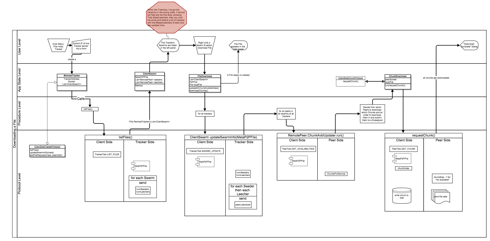

latex input:    mmd-article-header
Title:          p2p-gui
Author:         Ethan C. Petuchowski
Base Header Level:      1
latex mode:     memoir
Keywords:       Java, JavaFX, Java 8, P2P, BitTorrent, uTorrent
CSS:            http://fletcherpenney.net/css/document.css
xhtml header:   
latex input:    mmd-natbib-plain
latex input:    mmd-article-begin-doc
latex footer:   mmd-memoir-footer

## Rethink

### Better separation of concerns

* `Main` should be an object that gets instantiated, instead of relying on
  everything to be `static`
    * This will make the subcomponents more directly testable
    * The main change is that `ClientState`'s components be simply made non-
      static, and `Main` gets a non-static instance of `ClientState`
* Instead of the the User directly creating an instance of `FileDownload` using
  the GUI, there should be a **small API** with which the GUI layer interacts
  with the layer underneath (which I've called "`app`" in the module hierarchy,
  but I think the GUI is technically called the "application layer").
* This so-called `app` layer should be composed of `____Manager`s that export
  high-level capabilities to the GUI layer, e.g.
    * `filesManager`
        * `.downloadFile(MetaP2P, Collection<Tracker>)`
        * `.uploadFile(File)`
    * `trackersManager`
        * `.addTracker(ipAddr:String)`
        * `.refreshTracker(Tracker)` (we have the instance due to having
          rendered it in the UI)

### FilesManager

* `Collection<Peer>`

### Peer

* `InetSocketAddr`
* `Socket`
* Metadata about connection history (e.g. avg dl/upl speed)

### A MetaP2PFile is-a .torrent file

* An instance of `MetaP2PFile` should be able to map itself to and from `JSON`
* The `MetaP2PFile` should contain a hash for *each* `Chunk` like it is in
  BitTorrent, because if you get a bad `Chunk`, you don't want to have to
  redownload *all* the `Chunk`s

### FileDownload

* Use memory-mapped files instead of file-seeks

## TODOs

1. Change `Main` into an instance, and all static members into instances
2. See what's good about the whole `ConnectionManager`, `PeerManager`,
   `EtcManager` approach
3. `ChunksForService` serialization
4. `PeerDownload.getAvbl()`
5. `FileDownload.run()`

## Note

The *variable file chunk sizes* feature is not currently implemented
because it really doesn't need to be in any sort of 1.0 version and it is one
more thing to keep track of. So chunk sizes are assumed to be
`Common.NUM_CHUNK_BYTES` (currently 8KB for nor reason). If the functionality
were to be added, it would need to go into the `MetaP2PFile` and (if desired)
added to the `serializeToString()` method.

## New Download Process (Based on Greg)

* The key point is to maintain a persistent connection to peers, and *not*
  close it after downloading each chunk.
* I'm not *entirely sure* the connection is being closed after each chunk right
  now, but I think it is.
* This doesn't really affect the ease of figure out which Peers are faster to
  download from, but it is one method of making it so that more Chunks are
  downloaded from the faster Peers.
* One thing Greg was pushing was being able to simultaneously request multiple
  chunks, esp. contiguous ones. To my mind, it remains to be seen whether after
  making sure the connection remains open, this really makes it a big
  difference, but it certainly *could*.

### So here it is

1. Use all the File's known Trackers to figure out who all the Peers are
   (seeders and leechers)
2. Ask each peer (regardless of whether it is a seeder or leacher) for its
   BitMap
    * This doubles as a way of checking whether the Peer is online 
3. Each `PeerConnection` gets its own socket, and access to a queue of chunks
   that should be downloaded, organized (approximately) by [lack of]
   replication, and keeps dequeing it and downloading that chunk from its
   connection.

## How a Client downloads a File

### Flowchart of the Process (1st vrsn)

### Relevant Fields

    /* in package 'client' of module 'p2p-client' */
    public class Main {
        static ObservableList<AbstractRemoteTracker> knownTrackers;
    }

    /* in module 'p2p-core' */
    public class AbstractRemoteTracker {
        ListProperty<ClientSwarm> swarms;
    }

    public class ClientSwarm {
        ListProperty<RemotePeer> leechers;
        ListProperty<RemotePeer> seeders;
        ObjectProperty<MetaP2PFile> p2pFile;
        ObjectProperty<AbstractRemoteTracker> tracker;
    }

    public class RemotePeer {
        MapProperty<MetaP2PFile, ChunksForService> chunksOfFiles;
        ObjectProperty<InetSocketAddress> servingAddr;
    }

    public class MetaP2PFile {
        StringProperty filename;
        IntegerProperty filesizeBytes;
        StringProperty digest;
    }

### Before we Begin
1. (done) The Client connects to (and instantiates) an `AbstractRemoteTracker`
   by Socket Address and on it calls `ClientSideTrackerProtocol`'s
   `listFiles()` RPC to obtain `ClientSwarm`s to fill in the `Tracker`'s
   `swarms` field.
2. Each of the `Swarm`s has a `MetaP2PFile`.
2. (done) Initially, the `chunksOfFiles` property of each `RemotePeer` in a
   `ClientSwarm` is empty, because the Tracker does not maintain that info (it
   only maintains the `servingAddr`s).

### It starts with the User Interface
3. User right-clicks on a Tracker's file and selects `Download File`.
    * This triggers `TrackersCell.updateItem().isSwarm()->downloadFile()`.

### starting at downloadFile()
4. We create a `P2PFile`, and hence a `File` in `Main`'s user-configured
   `localFiles` directory.
4. We also create a `FileDownload` object, which sends a each `RemotePeer`
   (both `seeders` and `leechers`) `PeerTalk` Protocol's `GET_AVAILABILITIES`
   which asks which `Chunk`s each has available for download, and store that
   info in the `RemotePeer`.
5. We determine the "availability" (replication count) of each `Chunk`.
6. For each chunk, choose a random `RemotePeer` to download from.
7. Instantiate `ChunkDownload` objects for each chunk.
8. Submit them all to `Main`'s `fileDownloadPool`.
9. When `ChunkDownload`'s `run()` calls `ClientSideChunkProcotol`'s
   `requestChunk()`, it kicks off `ServerSideChunk`'s `serveChunk()` which is
   asynchronous (starts a new thead to do the serving).
10. Each [some amount] downloaded during `requestChunk()` has its data stored
    in the appropriate offset of the file.
11. If a `ChunkDownload` ever `timeout()`s while receiving a *part* of a
    `Chunk`, it `cancel()`s itself.
12. When a `ChunkDownload` completes, it flips a bit in `FileDownload`'s
    `completeChunks` `BitSet`
13. When the last bit gets flipped, the hash (`MetaP2PFile digest`) is
    compared, and if all goes well the `FileDownload` is finished.

#### Chunk Download Protocol

##### What happens upon calling `ChunkDownload`'s `requestChunk()`

1. `Client` opens socket to `PeerServer`
2. `Client` sends `GET <filename> <chunkIdx>\n\n`
3. `Server` sends `<Chunk.chunkSize>\n\n`
4. `Client` figures out how many times to try to `read()` from the
   `InputStream`
5. `Server` sends `Chunk.data`
6. `Client` loops through, `read()`ing to a medium buffer, updating the
   `ProgressBar` (somewhere), and sometimes dumping the buffer into the local
   file at the appropriate offset.
7. The `Chunk.chunkSize` bytes have been read, the socket is `close()`d

### GUI Events

#### Chunk download progress bars

#### File download progress bars

#### Graph of download speed

1. There could be a global concurrent-safe counter that gets clicked every time
   [some amount] gets downloaded.
2. Then periodically (on the GUI thread) it figures out how much it has changed
   in the last [some timeframe] and updates the GUI's `downloadSpeed`.

### Improvements

1. Prioritize downloading from faster Peers
    * Keep track of `historicAvgSpeed` in `RemotePeer`
2. Cache recently-served chunks (not a lot) in the `PeerServer`

## A Client retrives Swarm info from a Tracker

This happens as the beginning of the process of a User downloading a file.

### Relevant Fields

    public class P2PFile {
        List<ClientSwarm> swarms;
        MetaP2PFile meta;
    }

    public class ClientSwarm extends Swarm<RemoteTracker, RemotePeer> {

        /* via Swarm<RemoteTracker, RemotePeer> */
        List<RemotePeer> seeders;
        List<RemotePeer> leechers;
        RemoteTracker tracker;
        MetaP2PFile meta;
    }

    public class RemoteTracker extends Tracker<ClientSwarm> 
                               implements ClientSideTrackerProtocol 
    {
        Socket connectionToTracker;
        PrintWriter out;
        BufferedReader in;

        /* via Tracker<ClientSwarm> */
        List<ClientSwarm> swarms;
        InetSocketAddress trkrListenAddr;

        /* for ClientSideTrackerProtocol */
        public ClientSwarm updateSwarmInfo(MetaP2PFile meta) {
            ClientSwarm clientSwarm = new ClientSwarm(meta, this);
            requestSwarmInfoFor(meta);
            int numSdrs = fromWire();
            int numLchrs = fromWire();
            for each seeder=fromWire(): add seeder to swarm;
            for each leecher=fromWire(): add leecher to swarm;
            return clientSwarm;
        }
    }
